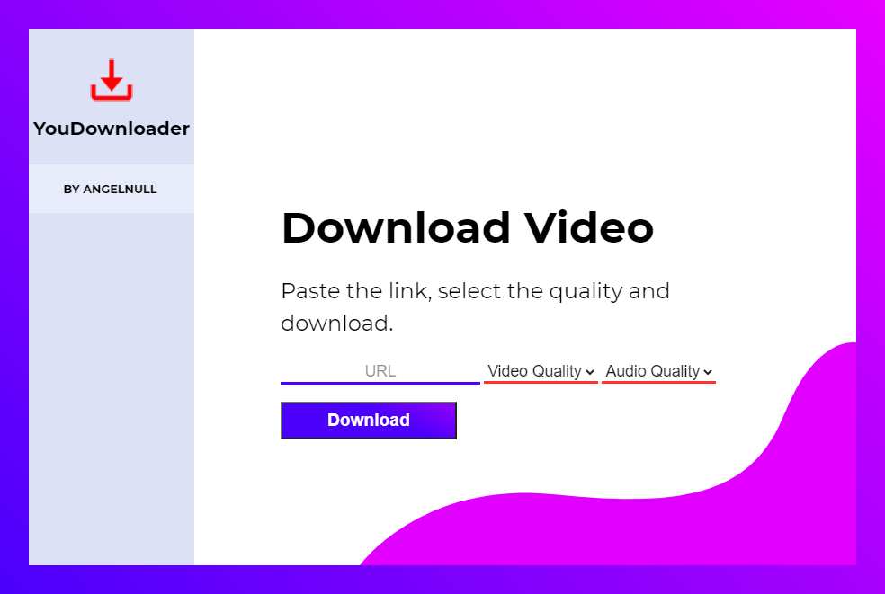

<!--PROJECT HEAD-->
 

  

  <h3 align="center">YouDownloader</h3>

  

    The light-weight and easy to use YouTube downloader
     
    <a href="https://github.com/AngelNull/YouDownloader/releases"><strong>Download »</strong></a>
     
     
    <a href="#contributing">Contributing</a>
    ·
    <a href="https://github.com/AngelNull/YouDownloader/issues">Issues</a>
    ·
    <a href="https://github.com/AngelNull/YouDownloader/pulls">Pull Requests</a>
  

<!--Contributors-->

<!--Forks-->

<!--Stars-->

<!--Issues-->

# 
<h2 align="center"> Preview </h2>

# 
<!-- TABLE OF CONTENTS -->

  
Table of Contents

  <ol>
    <li>
      <a href="#information">Information</a>
      <ul>
        <li><a href="#features">Features</a></li>
        <li><a href="#installing">Installing</a></li>
        <li><a href='#built-with'>Built-With</a></li>
      </ul>
    </li>
    <li>
      <a href="#contributing">Contributing</a>
      <ul>
        <li><a href="#issues">Issues</a></li>
        <li><a href="#setting-up-for-developers">Setting Up</a></li>
        <li><a href='#pull-requests'>Pull Requests</a></li>
        </ul>
        </li>
      </ul>
    </li>
    <li><a href="#license">License</a></li>
  </ol>

# Information
YouDownloader is a lightweight and easy to use YouTube downloader software, ran locally. All downloading and processing of the video is done client-side instead of relying on a server.

## Features

- Easily download YouTube videos.
- Choose video resultion and audio quality.
- Unlimited downloads, forever.
- No advertisements or restrictions.

## Installing

Downloading and using YouDownloader is easy, simply download the [latest release](https://github.com/AngelNull/YouDownloader/releases) from the release assets tab and extract the zip file. Then run the .exe and you're good to go.

If you live on the edge, you can download the latest developer release which contains the latest version of YouDownloader, but may not be as stable.

## Built With
This software has been built with the following production dependancies:    
**FFMPEG** - For merging audio and video together     
**Fluent-FFMPEG** - Also for handling merging of audio and video   
**YTDL-Core** - Downloading audio and video of the requested youtube link   
**Electron** - To allow for launching YouDownloader as a desktop application 

# Contributing
Contributions are welcomed and greatly appreciated, as this is my first Electron app I'm sure there are plenty of things that could be improved!

## Issues 
Please use the provided issue templates when making an issue when possible, if none of them apply to what you are trying to open then select "other" from the list - issue template additions are welcomed in Pull Requests.

## Setting Up for Developers
Make sure you have [NodeJS 14+](https://nodejs.org/en/) installed beforehand.

1. Clone or Download the repository and CD into it.
2. Run `npm i` to install dependancies
3. Run npm start to run the application

Make all the changes you'd like to, test the app both with `npm start` and `npm make` to ensure it compiles, and before commiting run `npm run lint` to ensure there are no linting problems.

## Pull Requests
Please keep all commits in the pull request to the [commit convention](./.github/COMMIT_CONVENTION.md) to allow for automatic changelog generation when a release is made. 

Multiple jobs will be ran when a pull-request is made to ensure it is up to standards and builds correctly. A build artifact will be available for 90 days after the last workflow on the pull request is ran with the compiled archive. 

# License
📜 YouDownloader is licensed under the [**MIT** license](./LICENSE) (c) 2021 AngelNull.